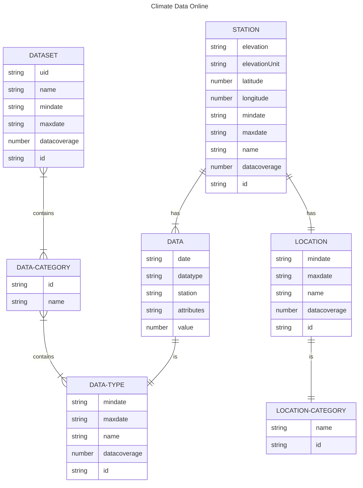

# temperature-blanket

```mermaid
---
title: Climate Data Online
---
erDiagram
    DATASET {
        string uid
        string name
        string mindate
        string maxdate
        number datacoverage
        string id
    }

    DATA-CATEGORY {
        string id
        string name
    }

    DATA-TYPE {
        string mindate
        string maxdate
        string name
        number datacoverage
        string id
    }

    LOCATION-CATEGORY {
        string name
        string id
    }

    LOCATION {
        string mindate
        string maxdate
        string name
        number datacoverage
        string id
    }

    STATION {
        string elevation
        string elevationUnit
        number latitude
        number longitude
        string mindate
        string maxdate
        string name
        number datacoverage
        string id
    }

    DATA {
        string date
        string datatype
        string station
        string attributes
        number value
    }

    STATION ||--|{ DATA : has
    DATA ||--|| DATA-TYPE : is
    STATION ||--|| LOCATION : has
    LOCATION ||--|| LOCATION-CATEGORY : is
    DATA-CATEGORY |{--|{ DATA-TYPE : contains
    DATASET |{--|{ DATA-CATEGORY : contains
```
